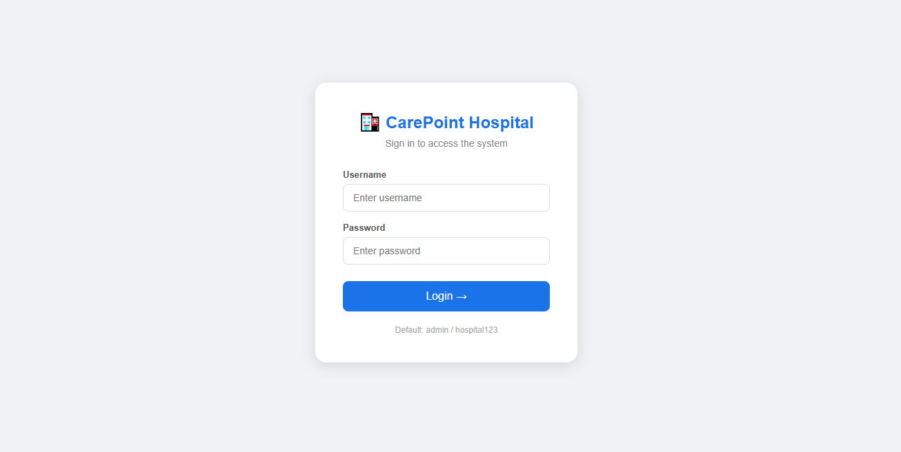
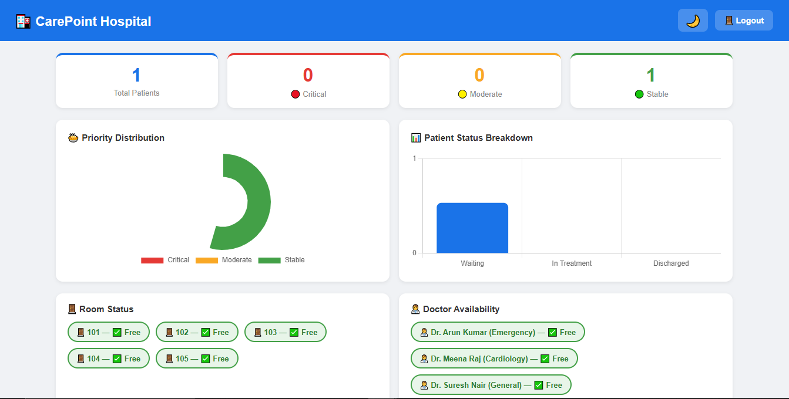
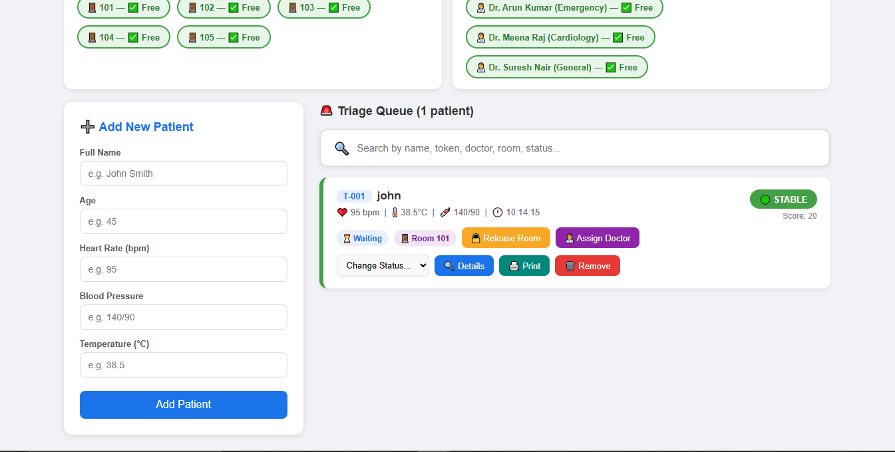

# CarePoint Hospital Triage System 🏥

A Smart Hospital Triage System built using Flask.

## Features
- Patient registration
- Symptom-based triage
- Priority assignment
- Simple UI

## Tech Stack
- Python
- Flask
- HTML/CSS

## How to Run
1. Install dependencies:
   pip install flask

2. Run the app:
   python app.py

3. Open in browser:
   http://127.0.0.1:5000/
## Screenshots

### 🔐 Login Page

### 📊 Dashboard

### 🏥 Patient Management

